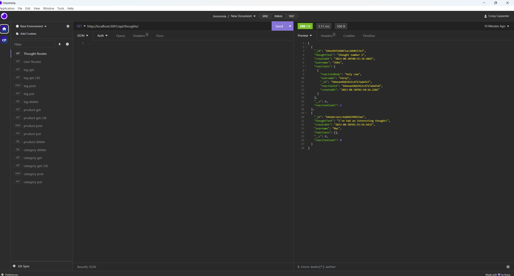

# Social Network Api

## This is a fully back end project that I built to practice for my final project. It lets you mess around with CRUD operations in the backend using users, their thoughts, and reactions to thoughts. I learned a lot about controllers and models and how to work with them. 

## To install clone the github repository to wherever you want in your computer.

## To use first run npm i and then npm start. After the server is started open insomnia or a similar app and have the address at localhost:3001/api/users or localhost:3001/api/users. You can switch between them as you wish. You'll find the routes in the routes/api folder and the information you need to pass in the models folder.

### I brought the config, controllers, models, routes, utils, index.js, and package.json from the mini project of week 18. I heavily adjusted them but it's where I got the original source code. 
